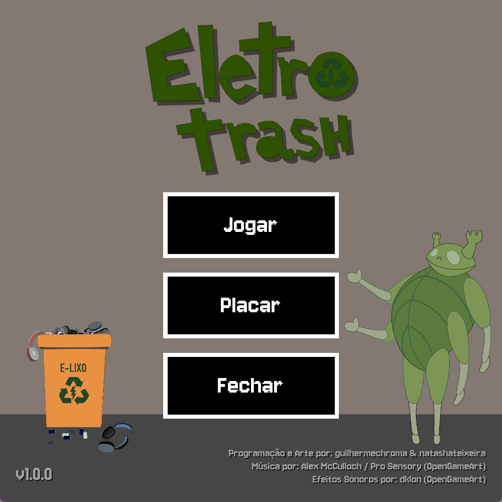
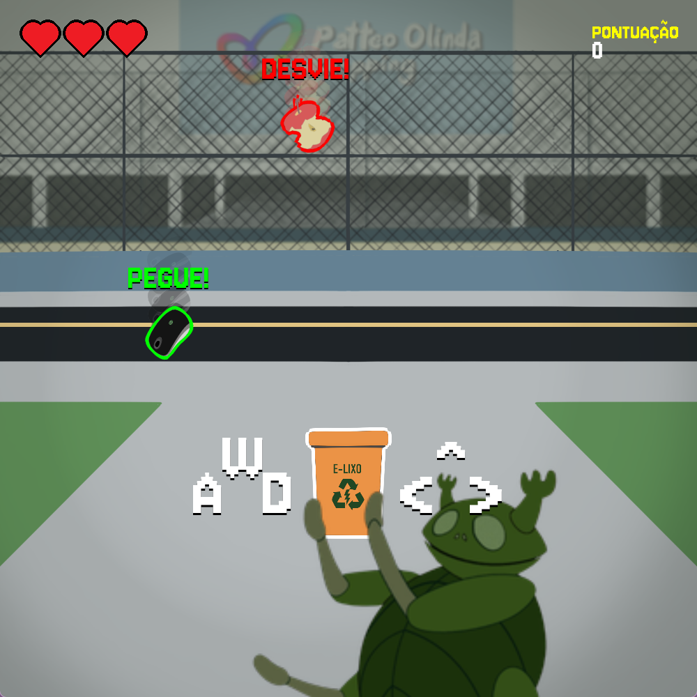
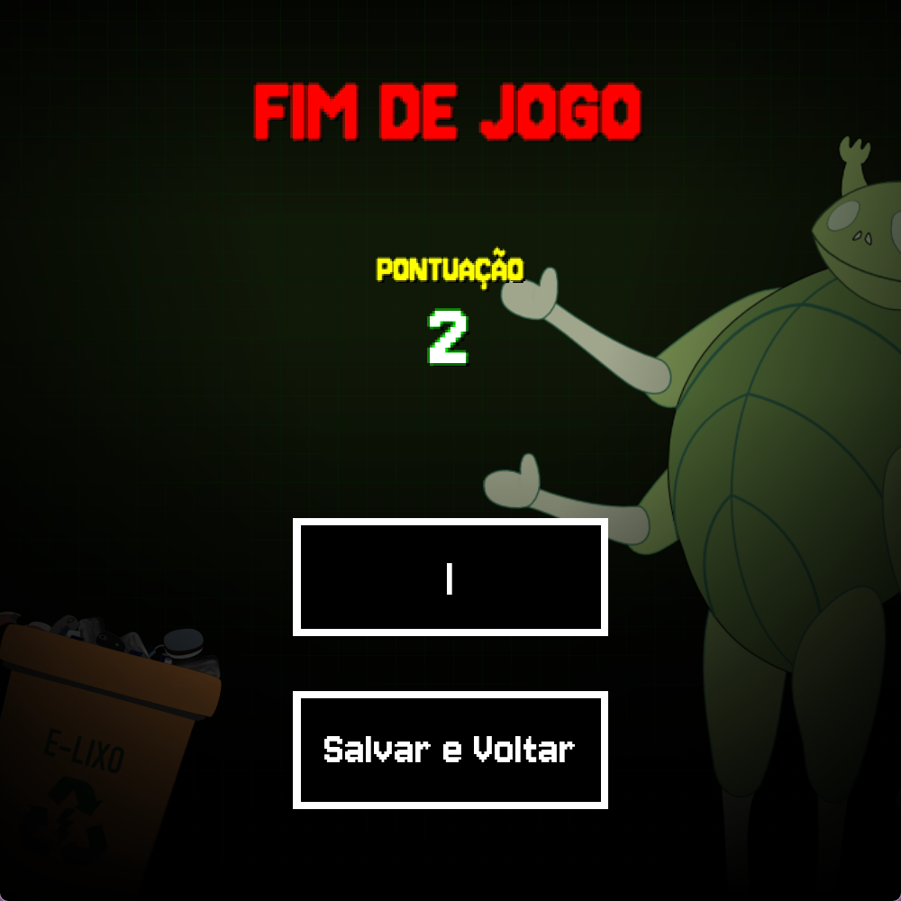
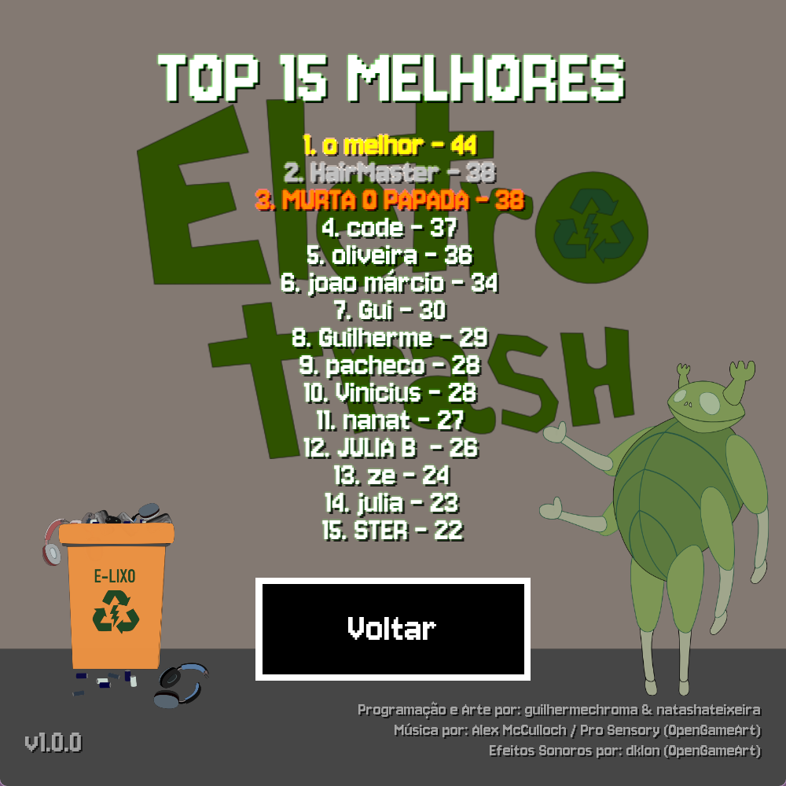
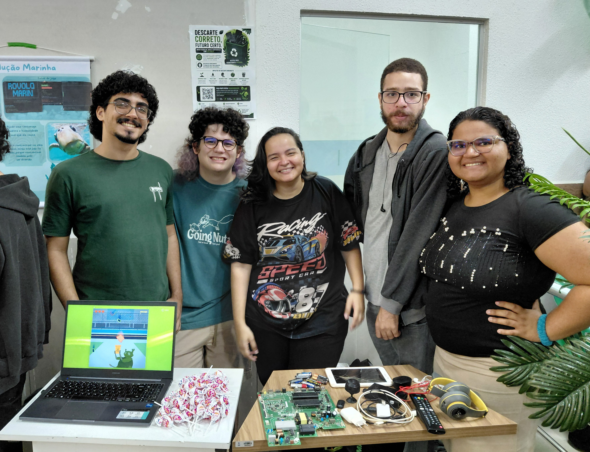
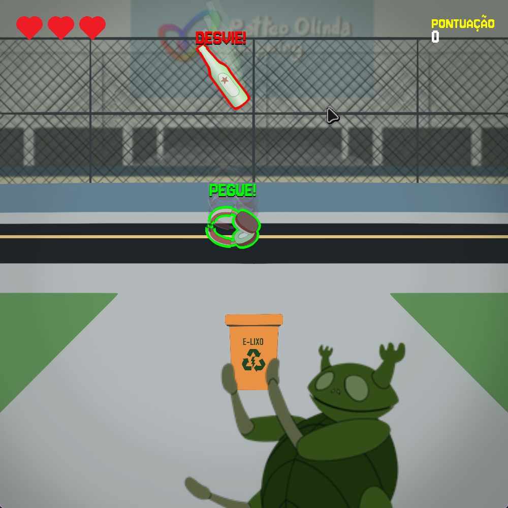

# 🌿 EletroTrash

> **Versão:** v1.0.0
> 
> Jogo desenvolvido para o evento *Ser Sustentabilidade* na Faculdade Uninassau Olinda, com o objetivo de conscientizar sobre o descarte correto de lixo eletrônico (e-waste).

## 🎮 Sobre o Jogo

Em **EletroTrash**, o jogador controla uma lixeira para lixo eletrônico, que é segurado pelo besouro **Carty**, com a missão de separar o lixo eletrônico corretamente.

Desvie dos itens de lixo comum (com contorno vermelho) que não correspondem a sua lixeira, e colete os componentes eletrônicos recicláveis (com contorno verde) para aumentar sua pontuação! O jogo conta com um visual retrô tecnológico, efeitos de luz em neon (estilo monitores antigos) e um sistema completo de ranking.

### ✨ Destaques da Versão 1.0.0 (Release)
* **Novo Visual de Interface:** Menus e telas com estética *cyberpunk/tech*, incluindo grades em movimento e textos com brilho aditivo (Neon).
* **Feedback Visual:** Contornos dinâmicos para facilitar a identificação da *hitbox*, efeitos de flash vermelho ao sofrer dano e botões interativos que piscam caso o jogador esqueça de digitar o nome.
* **Sistema de Placar (Leaderboard):** Ranking local que salva e exibe os **Top 15 Melhores Jogadores**, com destaque em Ouro, Prata e Bronze para o pódio.
* **Áudio Dinâmico:** Gerenciador de música contínuo que transiciona suavemente entre o Menu, o Jogo e a tela de Game Over.
* **Tutorial Integrado:** Instruções visuais que acompanham o jogador nos primeiros segundos de jogo para facilitar o aprendizado.

---

## ⌨️ Controles

* **Mover para a Esquerda:** Tecla `A` ou `Seta para Esquerda` (←)
* **Mover para a Direita:** Tecla `D` ou `Seta para Direita` (→)
* **Pular:** Tecla `W` ou `Seta para Cima` (↑)
* (Extra) **Tela cheia:** Alt + Enter

---

## 📸 Galeria (v1.0.0)

Aqui estão as telas da versão final de lançamento:

### Tela Inicial
> Menu animado com o título flutuante e o mascote Carty.

### Gameplay
> Ação rolando solta! Coletando itens bons e desviando das ameaças.

### Game Over / Fim de Jogo
> Tela de fim de jogo com sua pontuação e campo para salvar o nome do jogador.

### Placar
> Tela para exibir os 15 melhores pontuadores registrados no sistema (pode encontrar o arquivo em ``%localappdata%\EletroTrash\leaderboard.txt``).

---

## 👥 Equipe do Projeto

Essa foi a equipe incrível responsável tanto por dar vida ao projeto quanto por apresentá-lo no evento *Ser Sustentabilidade*, ainda como primeira versão alpha do jogo:

> Da esquerda para direita: 
> * **Guilherme Soares / guilhermechroma** (Programação)
> * **José Renato / Zé** (Relatório e Apresentação)
> * **Natasha Teixeira** (Design e Arte)
> * **Nycholas** (Suporte)
> * **Esther** (Apresentação)

#### Histórico:
> Primeira versão protótipo do jogo (v0.1.0) rodando durante a apresentação no evento.
